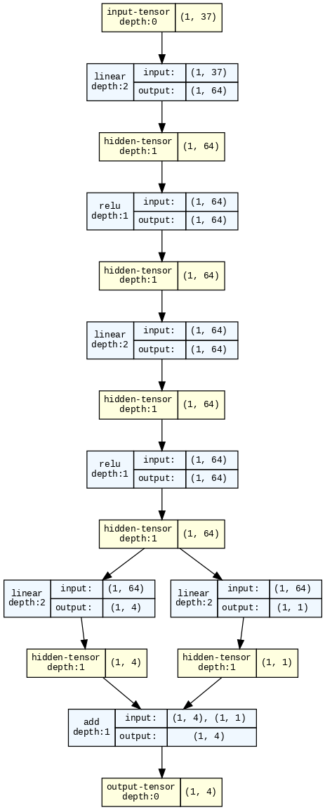

# Report on the Banana Navigation problem

## TL;DR
We use a Deep Q-Network (DQN) that is largely based on the [solution](https://github.com/udacity/deep-reinforcement-learning/tree/master/dqn/solution) to one of the problems discussed in the Udacity deep RL nanodegree program.[^1]

The snippet below shows the performance of a trained agent:\

[^1]: As a matter of fact, a working solution can be obtained using almost identical code with very minor modifications and no changes to the hyperparameters.

## Details of the implementation
### Deep Q-Network
We use a [dueling DQN approach](https://arxiv.org/abs/1511.06581) with two hidden layers having 64 units each, one layer corresponding to state levels and one to advantage values. The figure below shows the network architecture:\

